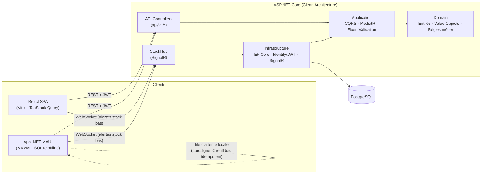

# Système d'inventaire — Web + Mobile

Application de gestion d'inventaire **API-first** : une seule API REST ASP.NET Core
(Clean Architecture) consommée à l'identique par un frontend **React** et une app
mobile **.NET MAUI** (scan de codes-barres, mode offline, synchronisation).

> Projet portfolio — Julien. Plan détaillé : `docs/Plan_Projet_Inventaire_Web_Mobile.pdf`.

---

## Stack technique

| Composant | Technologie |
|-----------|-------------|
| API Backend | ASP.NET Core 10 Web API (Clean Architecture) |
| Base de données | PostgreSQL + EF Core |
| Frontend Web | React 18 + TypeScript + Vite + Tailwind + TanStack Query |
| App Mobile | .NET MAUI + MVVM Community Toolkit + SQLite |
| Scan codes | ZXing.Net.MAUI (QR / code-barres) |
| Mode hors-ligne mobile | SQLite (sqlite-net-pcl, pattern Outbox) + service de synchronisation idempotent |
| Auth | ASP.NET Core Identity + JWT + Refresh Tokens |
| Temps réel | SignalR (hub `/hubs/stock`, consommé par React **et** le client SignalR mobile) |
| Notifications mobile | Notification OS locale (Plugin.LocalNotification) déclenchée par l'alerte SignalR |
| CQRS / Validation / Mapping | MediatR · FluentValidation · Mapster |
| Tests | xUnit · Moq · FluentAssertions · Testcontainers · Vitest |
| CI/CD | Docker · docker-compose · GitHub Actions |

> Le plan cible .NET 8 ; ce dépôt utilise le SDK **.NET 10** installé localement.

---

## Architecture (backend — Clean Architecture)

Règle de dépendance : **API → Infrastructure → Application → Domain**.
Le `Domain` ne dépend de rien.

```
InventorySystem.Domain          Entités, Value Objects, Domain Events, Exceptions métier
InventorySystem.Application     CQRS (MediatR), DTOs, interfaces, validation (FluentValidation)
InventorySystem.Infrastructure  EF Core (PostgreSQL), repositories, auth, SignalR, export
InventorySystem.Api             Controllers minces, middlewares, composition root
```

### Modèle de stock multi-entrepôt

`Product` est un catalogue pur (SKU, nom, seuil de réappro) — il ne porte **pas** la
quantité. Le stock est réparti par entrepôt via l'aggregate `Stock` (`ProductId` +
`WarehouseId` + `Quantity`, unique par paire), ce qui permet de vrais **transferts**
entre entrepôts (`StockMovement.Type = Transfer`, avec `WarehouseId` source et
`ToWarehouseId` destination). Le "stock bas" (`GetLowStockQuery`) est calculé en
agrégeant la quantité totale d'un produit sur tous ses entrepôts.

---

## Schéma d'architecture



Flux clé : un mouvement enregistré (web **ou** mobile) passe par `RecordMovementCommand`
→ met à jour `Stock` → si le seuil de réappro est franchi, `IStockNotifier` diffuse une
alerte via `StockHub`, reçue en temps réel par **tous** les clients connectés (dashboard
React + app mobile, qui affiche une notification OS locale). Le mobile hors-ligne met les
mouvements en file d'attente SQLite (`ClientGuid` généré côté client) et les rejoue dès que
la connectivité revient — le serveur rejette silencieusement tout rejeu déjà appliqué.

---

## Structure du dépôt

```
InventorySystem/
├── src/
│   ├── Backend/      Solution .NET (4 projets Clean Architecture)
│   ├── Frontend/     App React + TypeScript (Vite), Dockerfile + nginx.conf
│   └── Mobile/       App .NET MAUI + 3 class libs (Domain/Application/Infrastructure)
│                     Infrastructure : Api/, Persistence/ (SQLite offline), Realtime/ (SignalR), Sync/
├── tests/
│   ├── Backend.UnitTests/
│   ├── Backend.IntegrationTests/
│   └── Mobile.UnitTests/    (MovementSyncService — seule logique mobile à branches)
├── docker-compose.yml       postgres + pgadmin + api + frontend
└── .github/workflows/ci.yml backend + frontend + mobile (tests + build Android/Windows)
```

---

## Démarrage local

### Prérequis
- .NET SDK 10, Node.js 20+, Docker

### 1. Base de données
```bash
docker compose up -d postgres pgadmin
```

### 2. Backend (API)

Générer et appliquer les migrations EF Core (tables métier + tables Identity) :
```bash
dotnet tool install --global dotnet-ef   # une seule fois si pas déjà installé
dotnet ef migrations add InitialCreate \
  --project src/Backend/InventorySystem.Infrastructure \
  --startup-project src/Backend/InventorySystem.Api

# Après le refactor multi-entrepôt (Warehouse/Supplier/Stock, Product perd Quantity) :
dotnet ef migrations add AddWarehousesSuppliersAndStock \
  --project src/Backend/InventorySystem.Infrastructure \
  --startup-project src/Backend/InventorySystem.Api

dotnet ef database update \
  --project src/Backend/InventorySystem.Infrastructure \
  --startup-project src/Backend/InventorySystem.Api
```
(En PMC : `Add-Migration AddWarehousesSuppliersAndStock -StartupProject InventorySystem.Api` puis
`Update-Database -StartupProject InventorySystem.Api`, avec `InventorySystem.Infrastructure`
sélectionné dans le dropdown "Projet par défaut".)

Définir la clé de signature JWT (jamais en dur dans `appsettings.json` — voir §Sécurité) :
```bash
cd src/Backend/InventorySystem.Api
dotnet user-secrets init
dotnet user-secrets set "Jwt:Key" "<chaîne aléatoire d'au moins 32 caractères>"
cd ../../..
```

Amorcer le premier compte Admin (l'inscription publique force le rôle "Employe" — sans
ceci, il n'existe aucun moyen de créer le premier compte Admin autrement qu'en modifiant
la base à la main). Sans effet si un Admin existe déjà :
```bash
cd src/Backend/InventorySystem.Api
dotnet user-secrets set "Seed:AdminEmail" "admin@inventory.local"
dotnet user-secrets set "Seed:AdminPassword" "<mot de passe respectant la politique — 8+ car., 1 maj., 1 chiffre>"
cd ../../..
```

Puis démarrer l'API :
```bash
dotnet build InventorySystem.slnx
dotnet run --project src/Backend/InventorySystem.Api
# Swagger : http://localhost:5244/swagger (ouvert automatiquement, voir launchSettings.json)
```

### 3. Frontend (React)

Option A — développement (hot reload) :
```bash
cd src/Frontend
cp .env.example .env
npm install
npm run dev            # http://localhost:5173
```

Option B — conteneurisé (comme en CI/prod, aucun outil Node requis) :
```bash
docker compose up -d --build frontend   # http://localhost:5173, cible l'API sur :8080
```
`VITE_API_URL` est figée au build de l'image (Vite l'inline dans le bundle statique) via
l'argument de build défini dans `docker-compose.yml` — modifier cette valeur nécessite de
reconstruire l'image (`docker compose build frontend`).

### 4. Mobile (MAUI)

Auth + liste produits + mouvements (scan QR/code-barres, mode hors-ligne avec file
d'attente SQLite, notifications de stock bas en temps réel) : lance l'API en profil **http**
(`dotnet run --project src/Backend/InventorySystem.Api --launch-profile http`, port 5244),
le client mobile pointe dessus automatiquement (`ApiConfig.cs`, sans configuration
supplémentaire — y compris le hub SignalR `ApiConfig.StockHubUrl`). Le profil HTTP est
utilisé volontairement en dev/démo pour éviter le certificat auto-signé ASP.NET Core, non
approuvé par défaut sur un émulateur/simulateur.

```bash
cd src/Mobile
dotnet build InventoryMobile/InventoryMobile.csproj -f net10.0-android      # ou net10.0-windows10.0.19041.0
```

Sur l'émulateur Android, l'app cible automatiquement `10.0.2.2` (alias de l'hôte depuis
l'émulateur) ; sur un appareil physique ou pour la cible Windows, adapter `ApiConfig.BaseUrl`
si l'API ne tourne pas sur la même machine.

Le scan caméra n'est **pas** supporté par ZXing.Net.MAUI sur Windows (limitation officielle
de la librairie) — l'app affiche un message à la place plutôt qu'un écran caméra cassé.

---

## Endpoints principaux

| Endpoint | Accès | Note |
|----------|-------|------|
| `POST /api/v1/auth/register` \| `/login` \| `/refresh` | Public | Voir §Sécurité |
| `POST /api/v1/warehouses` | Gestionnaire+ | `GET` ouvert à Employe+ |
| `POST /api/v1/suppliers` | Gestionnaire+ | `GET` ouvert à Employe+ |
| `POST /api/v1/products` | Gestionnaire+ | Crée le produit **et** son stock initial dans un entrepôt existant |
| `GET /api/v1/products/low-stock` | Employe+ | Agrège le stock total par produit |
| `POST /api/v1/movements` | Employe+ | `Type: In \| Out \| Transfer` (transfert = `WarehouseId` source + `ToWarehouseId` destination) |
| `GET /api/v1/stocks/product/{id}` | Employe+ | Répartition du stock par entrepôt |

Ordre obligatoire pour tester dans Swagger : créer un **entrepôt** avant de pouvoir créer un
**produit** (qui exige un `warehouseId` valide pour son stock initial).

---

## Sécurité

- Authentification par JWT (access token courte durée) + refresh token opaque (rotation :
  chaque utilisation révoque et remplace le jeton — voir `RefreshTokenCommand`).
- Mots de passe hashés par ASP.NET Core Identity ; verrouillage après 5 tentatives échouées
  (15 minutes) pour limiter le brute-force.
- Rôles fixes `Admin` / `Gestionnaire` / `Employe`, exposés via des policies
  (`RequireAdmin`, `RequireGestionnaireOrAbove`, `RequireEmployeOrAbove`) plutôt que des
  chaînes de rôle en dur dans chaque controller.
- `Jwt:Key` n'est **jamais** commité : à définir via `dotnet user-secrets` en local (voir
  ci-dessus) ou une variable d'environnement / un coffre-fort en production. L'API refuse de
  démarrer une requête d'authentification si la clé est absente ou trop courte (fail-fast).
- CORS restreint aux origines listées dans `Cors:AllowedOrigins`.

---

## Tests

```bash
# Backend — unitaires
dotnet test tests/Backend.UnitTests/InventorySystem.Backend.UnitTests.csproj

# Backend — intégration (nécessite Docker : Testcontainers PostgreSQL)
dotnet test tests/Backend.IntegrationTests/InventorySystem.Backend.IntegrationTests.csproj

# Mobile — unitaires (MovementSyncService : la seule logique mobile avec branches à couvrir ;
# le reste du mobile est de la plomberie MVVM/plateforme non testée, comme le reste de l'app)
dotnet test tests/Mobile.UnitTests/InventoryMobile.Mobile.UnitTests.csproj

# Frontend
cd src/Frontend && npm run test
```

---

## État d'avancement

Les 17 premières étapes de la feuille de route (chapitre 13 du plan) sont terminées.
Seule l'étape 18 (déploiement live + artefacts de portfolio) reste ouverte.

- [x] Solution .NET + 4 projets Clean Architecture (structure + références)
- [x] Domain : `Product`, `StockMovement`, VO `Sku`, events, exceptions métier
- [x] Application : CQRS (MediatR), pipeline de validation, slices `Products`, `Movements`,
      `Warehouses`, `Suppliers`, `Stocks`
- [x] Infrastructure : `AppDbContext` (PostgreSQL), repositories, Unit of Work
- [x] API : composition root, middleware d'exceptions, tous les controllers métier
      (`ProductsController`, `MovementsController`, `WarehousesController`,
      `SuppliersController`, `StocksController`), Swagger (ouvert automatiquement en dev)
- [x] Authentification Identity + JWT + refresh token (rotation), rôles Admin/Gestionnaire/Employe,
      policies appliquées à tous les controllers métier, `AuthController`
- [x] Stock multi-entrepôt : `Product` catalogue pur, `Stock` par (produit, entrepôt),
      transferts entre entrepôts, agrégation pour le stock bas
- [x] Tests unitaires Domain (`Product`, `Stock`) et Application (21 tests, dont
      `RecordMovementCommandHandler` et `GetProductBySkuQuery`)
- [x] Frontend React : structure feature-based, client API, TanStack Query, dashboard,
      messages d'erreur spécifiques (détail réel du backend, pas de message générique)
- [x] Tests frontend (Vitest + React Testing Library)
- [x] Docker Compose (postgres + pgadmin + **api + frontend**, les deux conteneurisés avec
      Dockerfile dédié), pipeline GitHub Actions (backend, frontend, **et mobile**)
- [x] Migrations EF Core : `InitialCreate`, `AddWarehousesSuppliersAndStock`,
      `AddStockConcurrencyToken`, `AddStockMovementProductCreatedIndex` — toutes générées,
      à appliquer via `dotnet ef database update` (voir §Démarrage local)
- [x] Tests d'intégration API (20 scénarios : Register/Login/Refresh/policies de rôles +
      création produit/stock initial/mouvements In-Out/transferts entre entrepôts/stock
      insuffisant, `WebApplicationFactory` + Testcontainers PostgreSQL)
- [x] Export Excel/CSV (produits + historique des mouvements, global ou par produit —
      `IExportService`/ClosedXML/CsvHelper, endpoints `GET /products/export` et
      `GET /movements/export`, boutons côté React)
- [x] SignalR (`StockHub`) + temps réel côté React — alerte "Stock bas" diffusée quand
      une Sortie fait franchir le seuil à un produit (`IStockNotifier`, notifie une seule
      fois par franchissement, pas à chaque sortie tant que le produit reste bas)
- [x] Mobile MAUI — jalon 1 (auth + liste produits + mouvement, en ligne) : contrat Refit
      complet (`IInventoryApi`) miroir exact des controllers backend, session persistée via
      `SecureStorage` avec rafraîchissement proactif du token (`AuthHeaderHandler`), pages
      Login/Produits/Mouvement + ViewModels MVVM Community Toolkit, routing Shell
- [x] Mobile MAUI — jalon 2, complet :
      - **Scan QR/code-barres** (`ScanViewModel`/ZXing.Net.MAUI) → recherche par SKU
        (`GET /products/by-sku/{sku}`) → pré-remplissage du formulaire de mouvement ;
        caméra non supportée sur Windows (limitation officielle ZXing.Net.MAUI), message
        de repli affiché
      - **Mode hors-ligne** : file d'attente SQLite (`LocalMovement`, pattern Outbox,
        `sqlite-net-pcl`), idempotence via `ClientGuid` (le serveur rejette silencieusement
        tout rejeu déjà appliqué), synchronisation automatique déclenchée au retour sur
        l'écran produits, indicateur "en attente" dans l'UI
      - **Notifications temps réel** : client SignalR mobile (`IStockAlertHubClient`)
        connecté au même `StockHub` que le dashboard React, notification OS locale
        (Plugin.LocalNotification) à la réception d'une alerte de stock bas — pas de vrai
        FCM/APNs (nécessiterait un projet Firebase externe), donc ne réveille pas l'app si
        elle est complètement fermée
      - Tests unitaires mobile (`tests/Mobile.UnitTests`, `MovementSyncService`)
- [ ] Étape 18 : déploiement live (API + frontend) et artefacts de portfolio (captures
      d'écran, vidéo de démo) — voir §Prochaines étapes ci-dessous.

---

## Prochaines étapes (à faire manuellement)

Le code, les tests, Docker et la CI sont complets. Ce qui reste dépend de comptes/actions
externes qu'il faut faire soi-même :

1. Pousser sur GitHub et vérifier que les 5 jobs CI passent (`backend`, `frontend`,
   `mobile-unit-tests`, `mobile-build-android`, `mobile-build-windows`) — les deux derniers
   n'ont pas pu être exécutés dans cet environnement de développement (pas d'accès à GitHub
   Actions), à corriger au besoin si le workload MAUI échoue à l'installation.
2. Déployer l'API (Render/Railway/Azure App Service) et appliquer les migrations sur la
   base de données de production (`dotnet ef database update` avec la chaîne de connexion
   de prod, ou un job CI dédié).
3. Déployer le frontend (Vercel/Netlify) avec `VITE_API_URL` pointant vers l'API déployée.
4. Mettre à jour `Cors:AllowedOrigins` côté API pour inclure le domaine du frontend déployé.
5. Capturer des captures d'écran et une courte vidéo de démo (login → scan mobile →
   mouvement → mise à jour temps réel du dashboard web) pour le README/portfolio.
